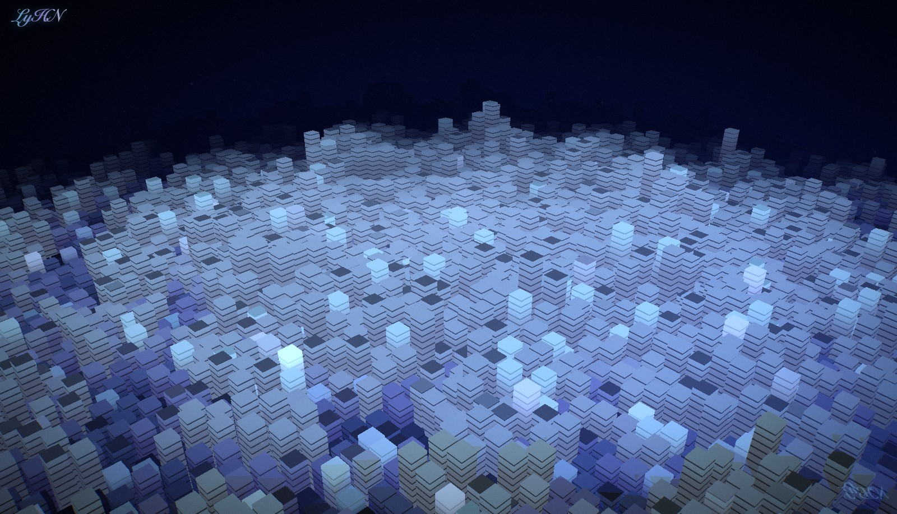

# Musical Groove · 声音星球

**中文** · [English](README.en.md)



让 macOS 随音乐**全屏律动**的音乐可视化 App。系统在放什么，一片弯曲穹顶上的「方块柱场」就跟着声音起伏，中心有发光的反应堆核心，顶部显示当前歌曲与同步歌词。

> A fullscreen macOS music visualizer (Three.js · WebGL + Electron): a curved dome of
> audio-reactive block pillars with a glowing reactor core, a live now‑playing card and
> synced lyrics. Captures system audio via ScreenCaptureKit — no extra audio device needed.

---

## 下载 / Download

最新版 → **[Releases](https://github.com/JavaLyHn/musical-groove/releases/latest)** （macOS · Apple Silicon / arm64）

**首次打开**（本 App 未经 Apple 签名，系统会拦一下，属正常）：
1. 打开 dmg，把 **Musical Groove** 拖进「应用程序」
2. 系统设置 → 隐私与安全性 → 找到 Musical Groove → 点 **「仍要打开」**（旧系统也可在「应用程序」里右键 App →「打开」）
3. 首次运行允许 **屏幕录制** 权限（用于读取系统声音驱动律动，不会录制或上传任何画面）→ **⌘Q 退出再重开**一次，律动才生效

## 使用 / Use

- 打开即全屏动画；放歌即律动
- 顶部歌曲卡：点开看大图 / 拖进度条 / 上一首 · 暂停 · 下一首
- 退出：**⌘Q**（或菜单栏托盘 ♪ → 退出）
- 想用电脑：**⌘‑Tab** 切到别的 App（会盖在动画上），切回来又是全屏
- 调参数：点左上角 **LyHN** 签名打开控制台；不保存关闭会还原到调整前

## 开发 / Develop

```bash
npm install
npm run dev        # 浏览器预览 http://127.0.0.1:5173  （?demo 用合成音频驱动）
npm test           # 单元测试 (Vitest)
npm run typecheck  # tsc --noEmit（纯 JS + // @ts-check）
```

## 打包 macOS App / Build

```bash
npm run dist:mac   # 构建原生模块 + Vite 产物 + electron-builder → release/*.dmg
```

产物：`release/Musical Groove-<version>-arm64.dmg`（未签名 / ad‑hoc）。

发布新版本（需先 `gh auth login`）：

```bash
gh release create v<version> "release/Musical Groove-<version>-arm64.dmg" \
  --target main --title "Musical Groove <version>" --notes-file <notes.md>
```

## 音频 / Audio

- **打包后（Electron）**：经 macOS **ScreenCaptureKit** 的「系统声音回环」捕获系统输出 —— 需屏幕录制权限，**免装 BlackHole**。
- **浏览器（开发）**：`?demo` 用合成频谱；真实音频走 Web Audio `AnalyserNode`（可配合 BlackHole 等回环设备取系统声音）。

两种来源实现同一接口（`getSpectrum() → Float32Array(64)` / `update(dt)`），切换不影响视觉。

## 画质 / Quality

`src/config.js` 里 `CONFIG.quality` = `'low' | 'mid' | 'high'`，或运行时 `?q=high` 覆盖。

## 技术 / Stack

Three.js（WebGL；自定义 GLSL 注入 `MeshStandardMaterial`，柱高与配色在顶点/片元着色器里按频段计算）· Electron · Vite · Vitest。

## 更新日志 / Changelog

见 [CHANGELOG.md](CHANGELOG.md)。

---

© 2026 **LyHN** · Musical Groove — 版权所有 · All rights reserved. 详见 [LICENSE](LICENSE)。
